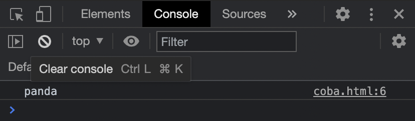

# I - Variabel

## Apa itu Variabel?

**Variable adalah tempat untuk menyimpan data.** Dengan menyimpan data di variable, **kita bisa menggunakannya lagi dengan menyebutkan nama variablenya**. Untuk membuat variable di JavaScript, kita bisa menggunakan kata kunci **`let`** atau **`const`** diikuti dengan nama variablenya. JavaScript adalah _dynamic language_ \(bahasa pemrograman bertipe data dinamis\), artinya variable di JavaScript tidak terpaku harus menggunakan satu tipe data, kita bisa mengubah-ubah tipe data di variable yang sama.  

## Deklarasi Variabel

Terdapat 2 kata kunci untuk mendeklarasikan sebuah variabel; **`const`** dan **`let`**. Untuk mendeklarasikan sebuah variabel yang tidak akan kita rubah lagi nilainya, maka kita gunakan **`const`**. Untuk mendeklarasikan sebuah variabel yang akan kita ubah-ubah nilainya makan kita gunakan **`let`**.

### Const

Contoh penggunaan `const` adalah sebagai berikut:



```markup
<html>
  <body>
    <script>
      const hewan = 'kucing';
      console.log(hewan);
    </script>
  </body>
</html>
```




Apa jadinya jika kita mencoba untuk mengganti variabel hewan pada contoh di atas? Mari kita coba untuk mengetahui hasilnya, **semisal jika kita ganti nilai dari variabel hewan** menjadi `panda`

### Let

Contoh penggunaan `let` adalah sebagai berikut:



```markup
<html>
  <body>
    <script>
      const hewan = 'kucing';
      hewan = 'panda'
      console.log(hewan);
    </script>
  </body>
</html>
```




Maka akan muncul sebuah error bahwa **menimpa nilai dari sebuah variabel konstan itu tidak diperbolehkan**. Jadi kalau kita mau menggunakan variabel yang bisa diubah-ubah nilainya, kita menggunakan let, contoh:



```markup
<html>
  <body>
    <script>
      let hewan = 'kucing';
      hewan = 'panda'
      console.log(hewan);
    </script>
  </body>
</html>
```





## Tipe Data

Pada dasarnya tipe data dari variabel dibagi menjadi 2 kategori, yaitu primitif dan non-primitif.

