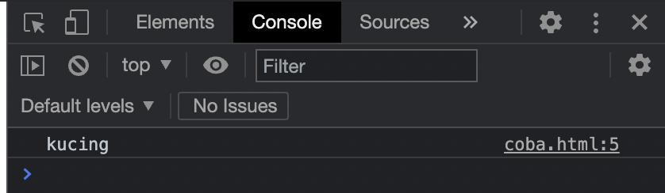
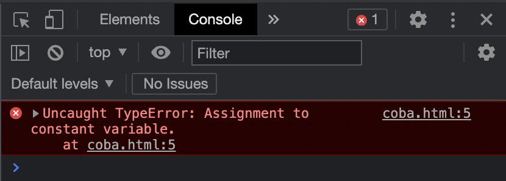
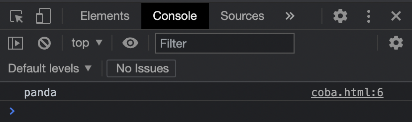

# I - Variabel

## Apa itu Variabel?

**Variable adalah tempat untuk menyimpan data.** Dengan menyimpan data di variable, **kita bisa menggunakannya lagi dengan menyebutkan nama variablenya**. Untuk membuat variable di JavaScript, kita bisa menggunakan kata kunci **`let`** atau **`const`** diikuti dengan nama variablenya. JavaScript adalah _dynamic language_ \(bahasa pemrograman bertipe data dinamis\), artinya variable di JavaScript tidak terpaku harus menggunakan satu tipe data, kita bisa mengubah-ubah tipe data di variable yang sama.

## Deklarasi Variabel

Terdapat 2 kata kunci untuk mendeklarasikan sebuah variabel; **`const`** dan **`let`**. Untuk mendeklarasikan sebuah variabel yang tidak akan kita rubah lagi nilainya, maka kita gunakan **`const`**. Untuk mendeklarasikan sebuah variabel yang akan kita ubah-ubah nilainya makan kita gunakan **`let`**.

### Const

Contoh penggunaan `const` adalah sebagai berikut:



```markup
<html>
  <body>
    <script>
      const hewan = 'kucing';
      console.log(hewan);
    </script>
  </body>
</html>
```





Apa jadinya jika kita mencoba untuk mengganti variabel hewan pada contoh di atas? Mari kita coba untuk mengetahui hasilnya, **semisal jika kita ganti nilai dari variabel hewan** menjadi `panda`

### Let

Contoh penggunaan `let` adalah sebagai berikut:



```markup
<html>
  <body>
    <script>
      const hewan = 'kucing';
      hewan = 'panda';
      console.log(hewan);
    </script>
  </body>
</html>
```





Maka akan muncul sebuah error bahwa **menimpa nilai dari sebuah variabel konstan itu tidak diperbolehkan**. Jadi kalau kita mau menggunakan variabel yang bisa diubah-ubah nilainya, kita menggunakan let, contoh:



```markup
<html>
  <body>
    <script>
      let hewan = 'kucing';
      hewan = 'panda';
      console.log(hewan);
    </script>
  </body>
</html>
```






Sebenarnya, untuk deklarasi variabel pada awal mulanya menggunakan kata kunci **var,** namun karena kegunaannya yang bisa dibilang kurang tepat lagi dan menimbulkan masalah/bug, maka **let** dan **const** muncul dan yang sekarang aktif dipakai.


## Peraturan Format Nama

Pada JavaScript, terdapat 2 peraturan format nama variabel \(_Variable's naming convention_\) yang lazim digunakan, yaitu **camelCase** dan **UPPERCASE.** Pada sebagian besar kasus, kita akan sering menggunakan camelCase, namun untuk penggunaan variable yang merupakan sebuah nilai konstanta bersama _\(shared constants\)_ yang dapat diakses dari mana saja \(tidak hanya dapat diakses dari satu file saja\), maka menggunakan UPPERCASE. 

Untuk penulisan camelCase, seperti menuliskan kata pada umumnya namun spasi dihilangkan dan setelah spasi yang dihilangkan itu huruf pertama dari kata selanjutnya diubah menjadi kapital.

Untuk penulisan UPPERCASE, seperti menuliskan kata pada umumnya namun semua hurufnya diubah menjadi huruf kapital dan spasi diganti dengan garis bawah _\(underscore\)._

Contoh penulisan sebagai berikut:



```markup
<html>
  <body>
    <script>
      const ibukotaIndonesia = 'Jakarta'; // camelCase
      const IBUKOTA_INDONESIA = 'Jakarta'; // UPPERCASE
      
      const pengaturanWarnaTema = 'gelap'; // camelCase
      const PENGATURAN_WARNA_TEMA = 'gelap'; // UPPERCASE
      
      const hewan = 'kucing'; // camelCase
      const HEWAN = 'kucing'; // UPPERCASE
    </script>
  </body>
</html>
```



## Tipe Data

Tipe data adalah jenis-jenis data yang bisa kita simpan di dalam variabel. Pada dasarnya tipe data dari variabel dibagi menjadi 2 kategori, yaitu primitif dan non-primitif.

**Kenapa harus ada tipe data?**  
Karena sejatinya ada perilaku yang berbeda-beda untuk interaksi antara data itu sendiri. Sebagai contoh jika kita ingin melakukan penjumlahan angka 62 + 080, maka hasil yang kita harapkan adalah 141 bukan? Ya, kita bisa menggunakan tipe data **`number`** untuk mendapatkan hasil tersebut. Namun jika kita ingin menggabungkannya, dalam kasus ini adalah nomor telepon, maka hasil yang kita harapkan adalah 62080 bukan? Ya, kita bisa menggunakan tipe data **`string`**.

