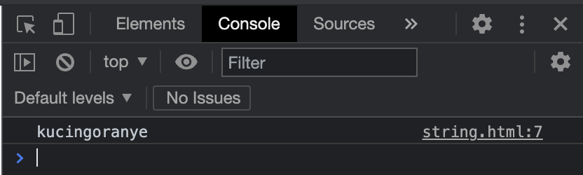
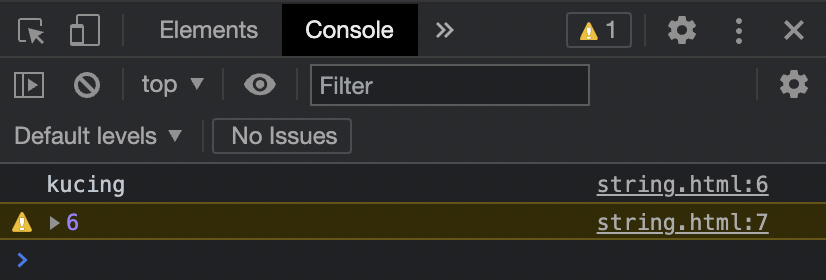

# Tipe Data Primitif

Terdapat 3 tipe data primitif yang sering dipakai, yaitu:

* String
* Number
* Boolean

## String

Tipe data string atau text adalah tipe data yang berisikan kumpulan karakter. Di JavaScript, untuk membuat data dengan tipe string, kita perlu menggunakan **`“`** \(petik dua\) atau **`‘`** \(petik satu\) sebelum dan setelah isi text nya. Contoh:



```markup
<html>
  <body>
    <script>
      const kosong = '';
      const hewan = 'kucing';
    </script>
  </body>
</html>
```



String memiliki beberapa kemampuan/perilaku khusus yaitu:

### Penggabungan

Jika 2 variabel bertipe data string ditambahkan, maka akan terjadi penggabungan, sebagai contoh:



```markup
<html>
  <body>
    <script>
      const hewan = 'kucing';
      const warnaBulu = 'oranye';
      const hewanDenganWarnaBulu = hewan + warnaBulu;
      console.log(hewanDenganWarnaBulu);
    </script>
  </body>
</html>
```





### Jumlah Karakter

Pada variabel bertipe data string kita dapat mengetahui panjang atau jumlah karakter yang ada di dalamnya dengan cara menambahkan **`.length`** setelah variabel tersebut, sebagai contoh:



```markup
<html>
  <body>
    <script>
      const hewan = 'kucing';
      const panjangKarakterHewan = hewan.length;
      console.log(hewan);
      console.warn(panjangKarakterHewan);
    </script>
  </body>
</html>
```





## Number

JavaScript hanya mendukung satu tipe data number, dimana tipe data number di JavaScript bisa berupa bilangan bulat atau bilangan desimal.

Tipe seperti di bahasa pemrograman lain yang biasanya membedakan tipe data number bilangan bulat dan bilangan desimal, di JavaScript semuanya disatukan.

Sebagai contoh:



```markup
<html>
  <body>
    <script>
      const jumlahHewan = 9;
    </script>
  </body>
</html>
```



## Boolean

Tipe data boolean adalah tipe data yang berisikan data kebenaran, artinya hanya ada dua data, benar dan salah \(_**true**_ dan _**false**_\).

Benar di representasikan dengan kata kunci **true**, dan salah direpresentasikan dengan kata kunci **false.**

Walaupun tipe data boolean merupakan tipe data yang sangat sederhana, tapi tipe data boolean akan banyak digunakan di berbagai fitur pemrograman.

Sebagai contoh:



```markup
<html>
  <body>
    <script>
      const apakahHewan = true;
    </script>
  </body>
</html>
```




