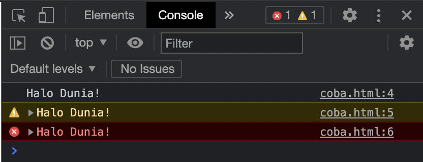
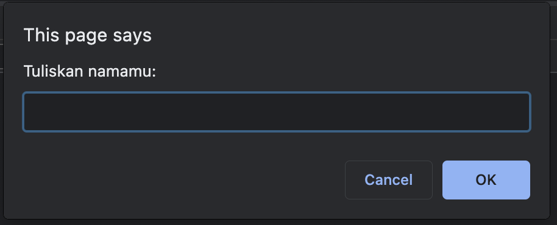

# Persiapan Belajar

## Peralatan Belajar

### 1. Web Browser / Peramban Web

Kita akan menggunakan _web browser_ untuk melakukan pembelajaran JavaScript ini, sangat dianjurkan untuk memakai _web browser_ yang memiliki fitur _inspect page_. Beberapa list yang direkomendasikan adalah:

* Google Chrome: [https://www.google.com/chrome/](https://www.google.com/chrome/)
* Mozilla Firefox: [https://www.mozilla.org/en-US/firefox/](https://www.mozilla.org/en-US/firefox/)
* Opera: [https://www.opera.com/download](https://www.opera.com/download)


**Sangat dianjurkan untuk memakai Google Chrome \(versi terbaru\)**. Karena fitur bawaannya yang sudah sangat mendukung kita untuk belajar dan bekerja. Di sepanjang pembelajaran ini kita akan memakai Google Chrome untuk ilustrasi ataupun demo.


### 2. Text Editor / Pengolah Text

Text editor ini boleh apa saja yang penting nyaman, **dianjurkan untuk memakai** _**code editor**_ **yang memiliki penyorot sintaks** _**\(syntax highlighter\)**_ untuk dapat membaca kode dengan lebih mudah dan meminimalisir kesalahan. Beberapa list yang direkomendasikan adalah:

* VSCode: [https://code.visualstudio.com/download](https://code.visualstudio.com/download)
* Atom: [https://atom.io/](https://atom.io/)
* Sublime: [https://www.sublimetext.com/](https://www.sublimetext.com/)
* WebStorm: [https://www.jetbrains.com/webstorm/](https://www.jetbrains.com/webstorm/)


**Sangat dianjurkan untuk memakai VSCode \(versi terbaru\)**. Karena selain tidak berbayar alias gratis, VSCode juga sudah sangat memenuhi standard dan bisa dikustomisasi berdasarkan keinginan kita jika suatu saat dibutuhkan.


## Menjalankan Script

Pada pembelajaran JavaScript ini kita akan memakai tag `<script>` yang ada pada file HTML.  Ingat, yang penting dari contoh-contoh yang akan kita bahas hanyalah yang ada di dalam tag `<script></script>` saja ya! Sebagai contoh:



```markup
<html>
  <body>
    <script>
      console.log('Halo Dunia!');
    </script>
  </body>
</html>
```



> ^ Contoh sederhana file HTML dengan JavaScript di dalamnya

Kita tinggal simpan kode di atas dengan nama misalkan **contoh.html** kemudian kita buka file tersebut dengan _web browser_ kita.

## Melihat Hasil / Output

**Pada pembelajaran JavaScript ini kita akan menggunakan console pada web browser untuk melihat hasil atau output dari kode yang kita tulis.** Untuk membuka panel console ini, klik kanan pada halaman di Chrome atau tekan F12 lalu akan muncul sebuah panel di sebelah kanan, kemudian pindahkan _inspect_ pada tab console.  Seperti pada **contoh.html** di atas, kita akan mendapatkan output seperti berikut:


Ada beberapa tipe varian output menggunakan console, yang digunakan berdasarkan tujuan atau pembe, 3 yang paling sering digunakan yaitu: log, warn dan error.



```markup
<html>
  <body>
    <script>
      console.log('Halo Dunia!');
      console.warn('Halo Dunia!');
      console.error('Halo Dunia!');
    </script>
  </body>
</html>
```





Selain itu kita juga akan menggunakan **prompt\(\)** untuk melakukan input. Contoh untuk kasus mengambil input nama:



```markup
<html>
  <body>
    <script>
      prompt('Tuliskan namamu:');
    </script>
  </body>
</html>
```






